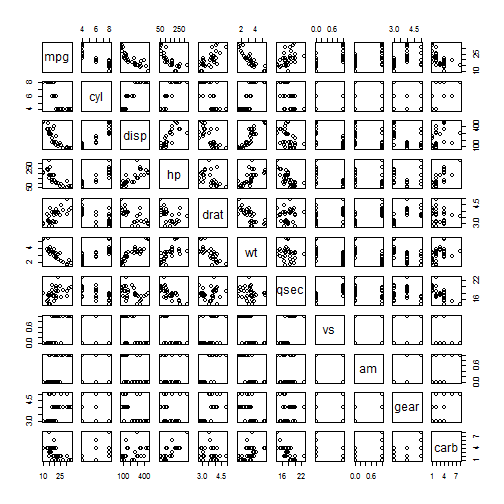

MPG-Predictor-Data-Product
==========================

Initial Commit

Car Mileage Predictor
========================================================
author: Frank Hasbani PMP, CSM
date: Oct, 25th, 2014

Ever wonder if your car's MPG you are currently driving is above or below average?
Are you evaluating a new car and would like to find out if it is delivering a good MPG?

Wonder no more. The Car Mileage Predictor is based on a predictive model conducted using public records of 32 cars of diverse makes and models. The Predictive Model and analysis are available for scrutiny at: 

Executive Summary 
========================================================

The Car Mileage Predictor is a calculator of Miles Per Gallon (MPG) of a hypothetical car based on the Weight(wt), Quarter Of A Mile in Seconds(qsec) and if the Transmission is Automatic or Manual.

- First enter the weight of your car in lbs.

- Second enter the number of seconds for the car to reach quarter of a mile

- Last check if the transmission is manual or leave unchecked for automatic

A Sample of the Source Data
========================================================
The Predictor Model Coefficients are:

```
            Estimate Std. Error t value  Pr(>|t|)
(Intercept)    9.618     6.9596   1.382 1.779e-01
wt            -3.917     0.7112  -5.507 6.953e-06
am             2.936     1.4109   2.081 4.672e-02
qsec           1.226     0.2887   4.247 2.162e-04
```
The multiple R squared is 0.8497, adjusted R Squared is 0.8336 and F-STatistic is 52.7496, 3, 28


Exploratory Data Analysis
========================================================

 


How to use this Predictor 
========================================================
- Predictor Tab is reactive to the 3 predictor variables in the SideBar Panel on the left side. 
- How to Use It: Explains how to effectively use and understand this tool 
- Raw Data Tab: Shows the source data used to build the prediction model in a Table format
- Structure Tab: Shows the structure of the same data
- Summary Tab: Shows the summary of both the Model and the Data, and explains the effectivness of the model.
- Box Plot Tab: Shows a Box Plot of the Variances of the MPG based of the number of cylinders
- Correlation Plot Tab: Shows the Correlation between all the Column Variables
